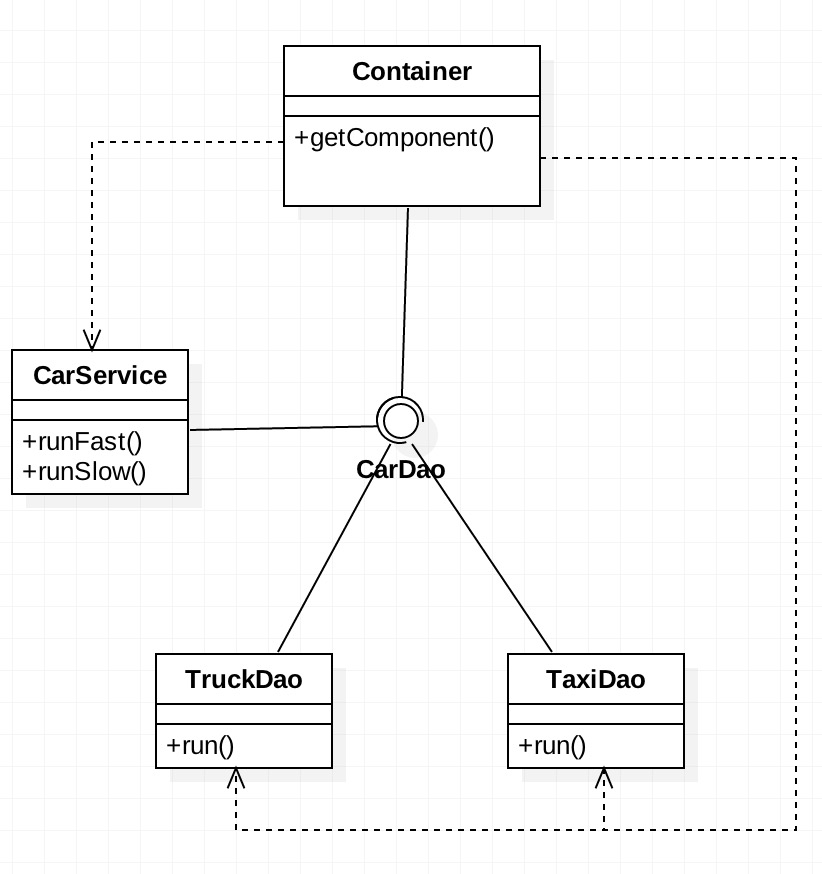

 <div align="center">
 Spring之控制反转和容器

</div>

<!-- more -->

# 控制反转 IoC

IoC (Inversion of Control, 控制反转)的设计原则，这一原则被许多容器用来解耦组件之间的依赖关系。Spring Framework提供了一个强大、可扩展的IoC容器来管理组件，这个容器就是Spring Framework的核心，同时也于Spring的其他模块紧密的集成在一起。


Ioc 是一个通用的设计原则，相比之下，DI（Dependency Injection，依赖注入）则是具体的设计模式，它体现了IoC 的设计原则。因为 DI 是 IoC 最典型的实现（但不是唯一的实现），所以属于 IoC 和 DI 经常混用。                                     





使用setter方式注入。

CarService.java

```java
public class CarService{
  
  private CarDao carDao;
  
  public void setCarDao(CarDao carDao){
    this.carDao = carDao;
  }
  
  public void runFast(){
    ...
  }
  
  public void runSlow(){
    ...
  }
}
```


其中 Container的代码如下：

```Java
public class Container{
  
  private Map<String,Object> components;
  
  public Container(){
    Components = new HashMap<String,Object>();
    
    CarDao carDao = new TruckDao();
    components.put("carDao",carDao);
    
    CarService carService = new CarService();
    carService.setCarDao(carDao);
    components.put("carService",carService);
  }
  public Object getComponents(String id){
    return components.get(id);
  }
}
```


# spring中的Bean配置


## 依赖注入的不同方式

通过setter方法注入依赖并不是实现DI的唯一方法。有四种DI

- setter注入
- 构造器注入
- 静态工厂注入
- 实例工厂注入


其中setter方式就是前面的例子中使用的方法。


- 构造器注入方式

```Java
public class CarService{
  
  private CarDao carDao;
  
  public CarService(){}
  public CarService(CarDao carDao){
    this.carDao = carDao;
  }
  ...
}
```

```java
public class Container{
  
  private Map<String,Object> components;
  
  public Container(){
    Components = new HashMap<String,Object>();
    
    CarDao carDao = new TruckDao();
    components.put("carDao",carDao);
    
    //使用构造器注入。
    CarService carService = new CarService(carDao);
    //carService.setCarDao(carDao);
    components.put("carService",carService);
  }
  public Object getComponents(String id){
    return components.get(id);
  }
}
```

- 静态工厂注入方式

BeanFactory.java
```Java
public class BeanFactory{
  
  //静态的方法
  public static Bean getBean(){
    return new Bean();
  }
}
```

spring.xml

```xml
...
<bean id="bean" class="com.ninom.bean.BeanFactory" factory-method="getBean"/>
...
```


- 实例工厂注入方式
  BeanFactory.java
```Java
public class BeanFactory{
  
  //普通的方法
  public  Bean getBean(){
    return new Bean();
  }
}
```

spring.xml

```xml
...
<bean id="beanFactory" class="com.ninom.bean.BeanFactory" factory-method="getBean"/>
<bean id="bean" factory-bean="beanFactory" factory-method="getBean"/>
...
```


> bean标签的常用属性

（1）id属性：起名称，id属性值名称任意命名，不能包含特殊符号,根据id值得到配置对象

（2）class属性：创建对象所在类的全路径

（3）name属性：功能和id属性一样的，id属性值不能包含特殊符号，但是在name属性值里面可以包含特殊符号

（4）scope属性

​		singleton：默认值，单例

​		prototype：多例

## 实例化Spring Ioc容器

### 问题描述

只有在容器实例化之后，才可以从IoC容器中获取Bean实例并使用他们。

### 解决方案

Spring提供了两种类型的IoC容器实现，基础的实现是Bean Factory，高级的实现是 ApplicationContext，其中后者是对前者的兼容扩展，两者的配置文件都是相同的。


Application Context 兼容基础特性的同事还提供了很多高级的特性，建议为每个应用程序都使用 Application Context。


### 实现方法

1. 实例化Bean Factory

   要实例化Bean Factory，首先必须将Bean配置文件加载到Resource对象中。

   ```Java
   Resource resource= new Resource("beans.xml");
   ```

   ​