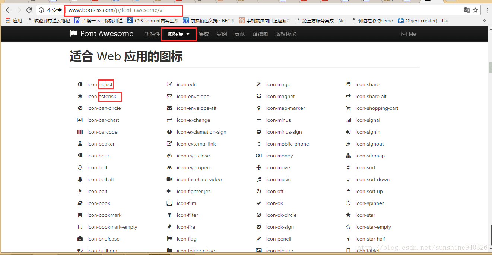

 <div align="center">
  博客优化日常札记

</div>

<!-- more -->


# 添加背景特效

## 第一种方法

[传送门](http://cdn.bootcss.com/canvas-nest.js/1.0.0/canvas-nest.min.js)。由于害怕未来这个地址失效，所以我们可以保存在本地。


1. 在我们的`next\source\js\src`下，添加文件`canvas-nest.min.js`，将上述地址的内容拷贝进去


2. 然后打开`next\layout\_layout.swig`，在之前添加如下代码

```Xml

    <script type="text/javascript" src="{{ url_for(theme.js) }}/src/canvas-nest.min.js"></script>
  
```

3. 打开`\next\_config.yml`，加入下面的代码：

   ```yaml
   # --------------------------------------------------------------
   # background settings
   # --------------------------------------------------------------
   # add canvas-nest effect
   # see detail from https://github.com/hustcc/canvas-nest.js
   canvas_nest: true
   ```

   4. 此时我们在重新部署打开，就能看到最终效果啦。


## 第二种方法

加入了特效后，发现很多部分都被白色内容挡住了，把他们都移走！


打开`next\source\css\_schemes\Pisces\_layout.styl`（这里你要是其他的主题，就把地址里的`Pisces`换成对应主题名）


找到

```css
.content-wrap {
  float: right;
  box-sizing: border-box;
  padding: $content-desktop-padding;
  width: $content-desktop;
  background: white;
  min-height: 700px;
  box-shadow: $box-shadow-inner;
  border-radius: $border-radius-inner;
}
```

将`background: white;`去掉，加入如下内容：


```Css
background:rgba(255, 255, 255, 0) none repeat scroll 0 0 !important;
background-color:#000000;
filter:Alpha(opacity=50);
position:static; 
*zoom:1;
```


## 第三种方法

在` themes/next/layout/_layout.swig` 中添加

```xml
<div class="bg_content">
    <canvas id="canvas"></canvas>
</div>
```

js原生代码

```javascript
 <script>
class Circle {
    //创建对象
    //以一个圆为对象
    //设置随机的 x，y坐标，r半径，_mx，_my移动的距离
    //this.r是创建圆的半径，参数越大半径越大
    //this._mx,this._my是移动的距离，参数越大移动
    constructor(x, y) {
        this.x = x;
        this.y = y;
        this.r = Math.random() * 10 ;
        this._mx = Math.random() ;
        this._my = Math.random() ;

    }

    //canvas 画圆和画直线
    //画圆就是正常的用canvas画一个圆
    //画直线是两个圆连线，为了避免直线过多，给圆圈距离设置了一个值，距离很远的圆圈，就不做连线处理
    drawCircle(ctx) {
        ctx.beginPath();
        //arc() 方法使用一个中心点和半径，为一个画布的当前子路径添加一条弧。
        ctx.arc(this.x, this.y, this.r, 0, 360)
        ctx.closePath();
        ctx.fillStyle = 'rgba(204, 204, 204, 0.3)';
        ctx.fill();
    }

    drawLine(ctx, _circle) {
        let dx = this.x - _circle.x;
        let dy = this.y - _circle.y;
        let d = Math.sqrt(dx * dx + dy * dy)
        if (d < 150) {
            ctx.beginPath();
            //开始一条路径，移动到位置 this.x,this.y。创建到达位置 _circle.x,_circle.y 的一条线：
            ctx.moveTo(this.x, this.y);   //起始点
            ctx.lineTo(_circle.x, _circle.y);   //终点
            ctx.closePath();
            ctx.strokeStyle = 'rgba(204, 204, 204, 0.3)';
            ctx.stroke();
        }
    }

    // 圆圈移动
    // 圆圈移动的距离必须在屏幕范围内
    move(w, h) {
        this._mx = (this.x < w && this.x > 0) ? this._mx : (-this._mx);
        this._my = (this.y < h && this.y > 0) ? this._my : (-this._my);
        this.x += this._mx / 2;
        this.y += this._my / 2;
    }
}
//鼠标点画圆闪烁变动
class currentCirle extends Circle {
    constructor(x, y) {
        super(x, y)
    }

    drawCircle(ctx) {
        ctx.beginPath();
        //注释内容为鼠标焦点的地方圆圈半径变化
        //this.r = (this.r < 14 && this.r > 1) ? this.r + (Math.random() * 2 - 1) : 2;
        this.r = 8;
        ctx.arc(this.x, this.y, this.r, 0, 360);
        ctx.closePath();
        //ctx.fillStyle = 'rgba(0,0,0,' + (parseInt(Math.random() * 100) / 100) + ')'
        ctx.fillStyle = 'rgba(255, 77, 54, 0.3)'
        ctx.fill();

    }
}
//更新页面用requestAnimationFrame替代setTimeout
window.requestAnimationFrame = window.requestAnimationFrame || window.mozRequestAnimationFrame || window.webkitRequestAnimationFrame || window.msRequestAnimationFrame;

let canvas = document.getElementById('canvas');
let ctx = canvas.getContext('2d');
let w = canvas.width = canvas.offsetWidth;
let h = canvas.height = canvas.offsetHeight;
let circles = [];
let current_circle = new currentCirle(0, 0)

let draw = function () {
    ctx.clearRect(0, 0, w, h);
    for (let i = 0; i < circles.length; i++) {
        circles[i].move(w, h);
        circles[i].drawCircle(ctx);
        for (j = i + 1; j < circles.length; j++) {
            circles[i].drawLine(ctx, circles[j])
        }
    }
    if (current_circle.x) {
        current_circle.drawCircle(ctx);
        for (var k = 1; k < circles.length; k++) {
            current_circle.drawLine(ctx, circles[k])
        }
    }
    requestAnimationFrame(draw)
}

let init = function (num) {
    for (var i = 0; i < num; i++) {
        circles.push(new Circle(Math.random() * w, Math.random() * h));
    }
    draw();
}
window.addEventListener('load', init(60));
window.onmousemove = function (e) {
    e = e || window.event;
    current_circle.x = e.clientX;
    current_circle.y = e.clientY;
}
window.onmouseout = function () {
    current_circle.x = null;
    current_circle.y = null;

};
</script>
```

然后在 `themes/next/source/css/_custom/custom.styl` 中，添加

```Css

body{
  z-index:9;
}
/*
.post {
  margin-bottom: 100px;
  padding: 25px;
  -webkit-box-shadow: 0 0 14px rgba(202,203,203,1);
  -moz-box-shadow: 0 0 14px rgba(202,203,204,1);
  background: #fff;
}
*/

.posts-expand .post-eof {
  display: block;
  margin: 0px auto 60px;
  width: 8%;
  height: 1px;
  background: #ccc;
  text-align: center;
}

/*首页点击出现下划线*/
.posts-expand .post-title-link:hover::before {
  visibility: visible;
  -webkit-transform: scaleX(1);
  -moz-transform: scaleX(1);
  -ms-transform: scaleX(1);
  -o-transform: scaleX(1);
  transform: scaleX(1);
}


.posts-expand .post-title-link{
  margin-bottom 20px;
  display: inline-block;
  position: relative;
  color: #555;
  border-bottom: none;
  line-height: 2.2;
  vertical-align: top;
}
/*侧边栏博客链接前面小圆圈颜色*/
.links-of-author a:before{
  color:#fff;
}

.bg_content{
  position: fixed;
  top: 0;
  z-index: -1;
  width: 100%;
  height: 100%;
}

#canvas{
  width: 100%;
  height:100%;
}
/*将头部背景变为透明*/
.header{
  background: transparent ;
}
@media (max-width: 767px){
  .menu {
    text-align: right;
  }
}

/*头像改为圆形，hover转动*/
.site-author-image {
  display: block;
  margin: 15px auto;
  /*padding: $site-author-image-padding;*/
  max-width: $site-author-image-width;
  height: $site-author-image-height;
  /*
  border: $site-author-image-border-width solid $site-author-image-border-color;
  */
  border-radius:50%;
  -webkit-transition: all 0.5s;
  -moz-transition: all 0.5s;
  -ms-transition: all 0.5s;
  -o-transition: all 0.5s;
  transition: all 0.5s;
}
.site-author-image:hover{
  -webkit-box-shadow:0 0 10px rgba(0,0,0,0.5);
  -moz-box-shadow:0 0 10px rgba(0,0,0,0.5);
  box-shadow:0 0 10px rgba(0,0,0,0.5);
  webkit-transform: rotate(360deg) scale(1.1);
  moz-transform: rotate(360deg) scale(1.1);
  ms-transform: rotate(360deg) scale(1.1);
  transform: rotate(360deg) scale(1.1);

}
@media (max-width: 767px) {

  .site-nav-toggle {
    display: none;
    position: absolute;
    top: 10px;
    right: 10px;
  }
}
```


# 添加博客底部的访问次数

在`themes/next/layout/_partials/footer.swig` 中

将

```Xml
<div class="theme-info">
  {{ __('footer.theme') }} -
  <a class="theme-link" href="https://github.com/iissnan/hexo-theme-next">
    NexT.{{ theme.scheme }}
  </a>
 </div>
```

替换成

```Xml
<div class="theme-info">
  {{ __('footer.theme') }} -
  <a class="theme-link" href="https://github.com/iissnan/hexo-theme-next">
    NexT.{{ theme.scheme }}
  </a>


<!--2017年5月14日16:46:55  添加 浏览次数pv -->
&nbsp;&nbsp;&nbsp;|&nbsp;&nbsp;&nbsp;
<span id="busuanzi_container_site_pv">
<i class="fa fa-user" aria-hidden="true"></i>
<span id="busuanzi_value_site_pv"></span>
</span>

&nbsp;&nbsp;&nbsp;|&nbsp;&nbsp;&nbsp;
<span id="busuanzi_container_site_uv">
  <i class="fa fa-eye" aria-hidden="true"></i>
  <span id="busuanzi_value_site_uv"></span>
</span>
</div>

<!--2017年5月14日16:46:55  添加 浏览次数pv -->
```


# 打赏

`themes/next/layout/_macro/reward.swig` 这个文件可以修改页面上的内容

# 网易云音乐

在知道了页面的结构之后，你就可以将你的播放器添加在页面的任意位置，开始我是放在了首页，然后发现一上来就自动播放太吵了，于是就放在了侧边栏，想要听得朋友可以手动点击播放， 我们可以直接在网易云音乐中搜索我们想要插入的音乐，然后点击生成外链播放器 


在`themes/next/layout/_macro/sidebar.swig`中

```Xml
	{# Blogroll #}
        
          <div class="links-of-blogroll motion-element {{ "links-of-blogroll-" + theme.links_layout | default('inline') }}">
            <div class="links-of-blogroll-title">
              <i class="fa  fa-fw fa-{{ theme.links_icon | default('globe') | lower }}"></i>
              {{ theme.links_title }}
            </div>
            <ul class="links-of-blogroll-list">
              
                <li class="links-of-blogroll-item">
                  <a href="{{ link }}" title="{{ name }}" target="_blank">{{ name }}</a>
                </li>
              
            </ul>
          </div>
        
```

这些代码的下方加入，网易云音乐的链接

```xml
 {# Blogroll #}
        
          <div class="links-of-blogroll motion-element {{ "links-of-blogroll-" + theme.links_layout | default('inline') }}">
            <div class="links-of-blogroll-title">
              <i class="fa  fa-fw fa-{{ theme.links_icon | default('globe') | lower }}"></i>
              {{ theme.links_title }}
            </div>
            <ul class="links-of-blogroll-list">
              
                <li class="links-of-blogroll-item">
                  <a href="{{ link }}" title="{{ name }}" target="_blank">{{ name }}</a>
                </li>
              
            </ul>
          </div>
        

	<!--网易云音乐 2017年05月14日18:49:16 -->


<iframe frameborder="no" border="0" marginwidth="0" marginheight="0" width=330 height=86 src="//music.163.com/outchain/player?type=2&id=16426514&auto=0&height=66"></iframe>

 	<!--网易云音乐 2017年05月14日18:49:16 -->
```


# Fork me on Github

[官方地址](https://github.com/blog/273-github-ribbons)


在官方地址中选取自己喜欢的绸带样式之后，找到 `/themes/next/layout/_layout.swig` 文件的body标签之内即可 
记得把里面的url换成自己的

```xml
 <header id="header" class="header" itemscope itemtype="http://schema.org/WPHeader">
      <a href="https://github.com/SimpleLifee">
      </a>
      <div class="header-inner">  </div>
 </header>
```


# 查找`FontAwsome` icon


这时候你想要换一个自己喜欢的icon怎么办，这就需要自己动手，丰衣足食了，你需要自己到[FontAwsome官网](http://www.bootcss.com/p/font-awesome/#)，然后鼠标往下拉，在图标集中选择自己喜欢的icon，然后记住名字，保存在上面的 `主题配置文件` 中的menu_icon字段中就可以啦~ 





tips ：在字段中只需要填写icon-name后面跟的name即可，不需要加上前面的”icon-“


# 为主页文章添加阴影效果

打开`themes/next/source/css/_schemes/Mist/_posts-expanded.styl`文件
找到类.posts-expand下面的.post


```javascript
.posts-expand {
  ...
  .post {
    margin-top: 120px;
   }
  ...
 }
```

修改后

```javascript
.posts-expand {
  ...

  .post {
    margin-top: 60px;
    margin-bottom: 60px;
    padding: 25px;
    -webkit-box-shadow: 0 0 5px rgba(202, 203, 203, .5);
    -moz-box-shadow: 0 0 5px rgba(202, 203, 204, .5);
   }
   ...   
 }
```

